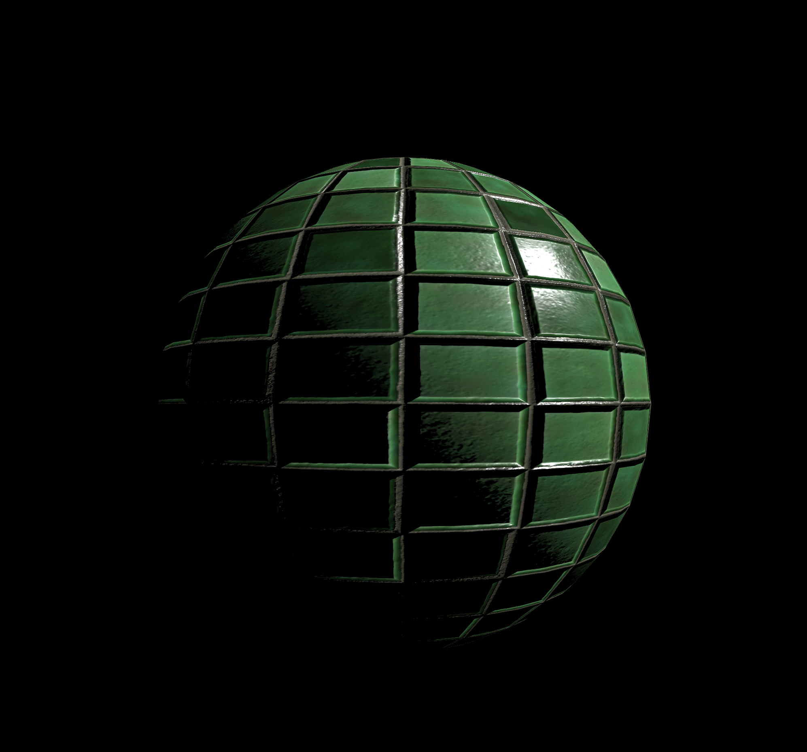

# PBR-Renderer
Sinple PBR renderer for learning purposes. 



## Features
* Physically based Rendering with Cook-Torrance BRDF
* Normal Mapping

## Build instructions
First of all, the next dependencies need to be installed:
* GLEW
* SDL2

If you want to simply build and test the project type the next command and that should be it!
``` bash
make
./bin/pbr
```
If you want to modify the code, if no more source files are created the before method would work fine. If not, project files need to be recreated, and for that the tool [premake](https://premake.github.io/) is used, specifically the fifth version. To recreate project files and rebuild 
```bash
premake5 gmake2
make clean && make
./bin/pbr
```

## Known issues
The next are already known issues and ways to fix them, for more information check the *issues* page on github.

* GLEW initialization failure: for wayland users, you will se a warning saying that will ignore a initialization error. All should work fine from that point on, but if you want to remove the warning, execute the app with the next command `SDL_VIDEODRIVER=X11 ./bin/pbr`

## References
* Great shout-out to the pages [learnopengl](https://learnopengl.com/) and [opengl-tutorial](http://www.opengl-tutorial.org/) for the great PBR theory and OpenGL tutorials.
